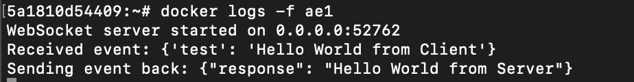
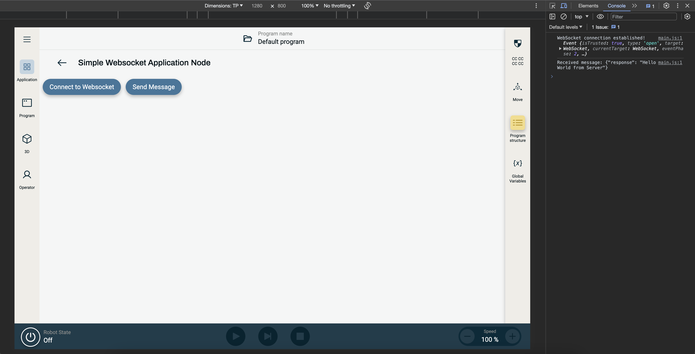

# Simple WebSocket Sample

This project is an example of how to use websocket based communication inside a URCap Contribution between the Docker backend and the Web frontend

Refer to the [official documentation](https://docs.universal-robots.com/) for more information.

## Build and Deploy Sample

In order to build and deploy this sample, use the commands below. A rebuild of the project is required to see any changes made to the source code.  If you are deploying the URCap to URSim, ensure that you have started the simulator.

### Dependencies

Run this command to install the dependencies of the project.

```shell
npm install
```

### Build

Run this command to build the contribution type.

```shell
npm run build
```

### Installation

Run this command to install the built URCap to the simulator.

```shell
npm run install-urcap
```

Run this command to install the built URCap to the robot.

```shell
npm run install-urcap -- --host <robot_ip_address>
````

## Backend Contribution
The backend contribution uses Python 3.11 with the `websockets` library ([official documentation](https://websockets.readthedocs.io/en/stable/)) to host as server on a specific port. The server adress and port used when spinning up the server is passed to the python file as arguments from the Dockerfile (in the entrypoint).

### Backend Output

Having built and installed the URCap in the simulator you can open your terminal to see the output from the backend:

```shell
docker exec -it ursim-polyscopex-runtime-1 bash
```

You can find more documentation on the `docker exec` functionality [here](https://docs.docker.com/reference/cli/docker/container/exec/).

Your terminal prompt should have switched from `psxdev@<vsc_container_id>:/pwd/$ ` to `<ursim_container_id>:/pwd/# `, meaning you can now execute commands within your simulator docker container.

List the active docker containers with:

```shell
docker ps
```

View the backend output by using the container ID associated with the `universal-robots_simple-websocket_simple-websocket-backend` image (e.g. 8e3):

```shell
docker logs -f <container_id>
```

E.g.:



## Frontend Contribution
The frontend contribution is built in Angular using no external libraries. The application node contains a button that connects to the WebSocket server, and another button that sends a predefined message to the server.

### Frontend Output
After building and installing the URCap onto the simulator, open the simulator in a Chromium browser. The Simple WebSocket Application Node will be found under the Application tab on the left.



Pressing "Connect to Websocket" and "Send Message" will print messages to the Browser Developer Tools JavaScript console. They keyboard shortcut to open the console is `Cmd + Option + J` on MacOS, and `Ctrl + Shift + J` on Windows/Linux.